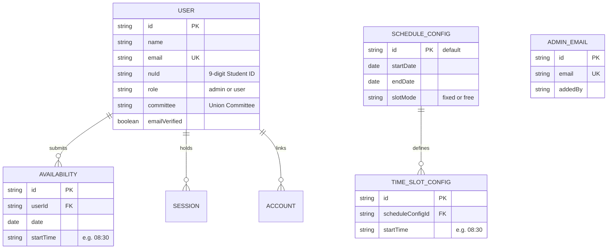

# Nile University Student Union (NUSU) Availability Tracker

A modern, mobile-first web application designed for the **Nile University Student Union (NUSU)** to streamline member availability tracking and identify optimal meeting times across committees and leadership teams.

Built with **Next.js 16**, **React 19**, **Turbopack**, **Tailwind CSS v4**, **Better Auth**, and **Prisma ORM 6** backed by **PostgreSQL** on **Supabase**.

---

## 🌟 Features

### 📅 Member Availability & Weekly Calendar
- **Dynamic Scheduling**: Supports configurable date ranges and bookable intervals defined by union leadership (default: Apr 19–23, 2026).
- **Mobile-First Bottom Sheet**: On mobile viewports (`< 768px`), slot selection opens in a smooth, swipeable bottom sheet drawer with native drag handles (via Vaul) instead of cramped modals.
- **Custom Segmented Time Picker**: Clean custom time picker with quick slot presets (`08:30 AM → 09:30 AM`, `09:30 AM → 10:30 AM`, etc.) replacing browser-native `--:-- --` inputs.
- **Full Interval Display**: Displays explicit start and end times on every slot card for clarity.
- **Atomic Slot Persistence**: Changes are automatically saved to PostgreSQL, replacing day slots atomically to eliminate race conditions or duplicates.

### 🔐 Authentication & Student Identity
- **Dual Authentication Modes**:
  - **Email & Password**: Registration captures Nile University Student ID (9 digits), full name, and NUSU Union Committee (Events, PR, HR, IT, Logistics, etc.).
  - **Google OAuth**: Optional single-click sign-in via Google accounts.
- **Role-Based Access Control (RBAC)**: Distinct permissions for Student Union members and Union Administrators (`admin` / `user`).
- **Responsive Sign-Out Confirmation**: Prevents accidental logouts using a native bottom sheet on mobile and an animated frosted modal on desktop.

### 📊 Admin Command Center (`/admin`)
- **Executive Metric Cards**: Total participants, total slot selections, peak concurrency count, and average slots per member.
- **Availability Density Matrix**: Color-graded heatmap grid across all days and time slots. Clicking any cell opens a drill-down breakdown showing the exact list of available members.
- **Top 5 Best Meeting Times**: Algorithmic ranking of the top meeting windows with highest mutual concurrency, complete with avatar stacks.
- **Committee Filtering**: Filter heatmap and participant rosters by specific Student Union committees.
- **Schedule Configuration Manager**: Live administrative interface to modify target calendar dates, add/remove time slots, and toggle between fixed and free booking modes.
- **User & Access Management**: Manage union members, promote administrators, and configure allowed administrative emails.
- **Automated Provisioning Endpoint**: Protected `/api/setup-admin` route for seamless administrator initialization and password resets.

### ✨ Visual Engineering & Craft
- **Frosted Glass Header**: Translucent floating navigation bar with layered backdrop blur (`backdrop-blur-xl md:backdrop-blur-2xl`) and specular top highlights.
- **Hardware-Accelerated Theme Beam**: Lightweight, GPU-composited radial sweep animation for silky-smooth light/dark mode transitions with zero layout jank.
- **High-Fidelity OKLCH Color Science**: Tailored Nile Navy and Availability Emerald palettes compliant with WCAG AAA accessibility standards.

---

## 🛠️ Tech Stack

| Layer | Technology |
| :--- | :--- |
| **Framework** | [Next.js 16](https://nextjs.org/) (App Router, Server Components, Turbopack) |
| **Frontend Library** | [React 19](https://react.dev/) |
| **Styling** | [Tailwind CSS v4](https://tailwindcss.com/) (`@tailwindcss/postcss`) |
| **UI Primitives** | [Base UI](https://base-ui.com/) + [shadcn/ui](https://ui.shadcn.com/) + [Vaul Drawer](https://vaul.emilkowal.ski/) |
| **Icons** | [HugeIcons](https://hugeicons.com/) & [Lucide React](https://lucide.dev/) |
| **Authentication** | [Better Auth](https://www.better-auth.com/) (Email/Password & Google OAuth) |
| **ORM** | [Prisma 6](https://www.prisma.io/) (`@prisma/client` 6.19.3) |
| **Database** | PostgreSQL 17 Alpine ([Supabase](https://supabase.com) with Supavisor IPv4 Pooler) |
| **Package Manager** | [pnpm](https://pnpm.io/) |

---

## 🎨 Brand & Design System (OKLCH Palettes)

The design system pairs deep **Nile Midnight Navy** with **Availability Emerald** and vibrant **Interactive Cyan** highlights. Both palettes utilize high-fidelity OKLCH color spaces for perceptual uniformity.

### ☀️ Light Mode Palette

| Token | OKLCH Value | Approx. Hex | Role & Usage |
| :--- | :--- | :--- | :--- |
| `--background` | `oklch(0.985 0.005 240)` | `#F8FAFC` | Clean porcelain canvas |
| `--foreground` | `oklch(0.145 0.03 250)` | `#0F172A` | Deep navy slate text & headings |
| `--card` | `oklch(1 0 0)` | `#FFFFFF` | Surface cards, dialogs, and popover menus |
| `--card-foreground` | `oklch(0.145 0.03 250)` | `#0F172A` | Primary card copy |
| `--primary` | `oklch(0.50 0.16 200)` | `#0284C7` | Primary buttons, links, active rings |
| `--primary-foreground` | `oklch(0.99 0.002 240)` | `#FFFFFF` | Contrast text on primary buttons |
| `--secondary` | `oklch(0.95 0.01 240)` | `#F1F5F9` | Secondary pill buttons and subtle chips |
| `--muted` | `oklch(0.95 0.01 240)` | `#F1F5F9` | Hover fills and disabled slots |
| `--muted-foreground` | `oklch(0.50 0.025 240)` | `#64748B` | Subtitles, labels, and secondary copy |
| `--border` / `--input` | `oklch(0.90 0.008 240)` | `#E2E8F0` | Dividers, card boundaries, and inputs |
| **Availability Emerald** | `oklch(0.65 0.16 160)` | `#10B981` | Active slots, checkmarks, heatmap peak density |

### 🌙 Dark Mode Palette

| Token | OKLCH Value | Approx. Hex | Role & Usage |
| :--- | :--- | :--- | :--- |
| `--background` | `oklch(0.14 0.025 250)` | `#0D1424` | Deep Nile Midnight Navy canvas |
| `--foreground` | `oklch(0.97 0.008 240)` | `#F1F5F9` | High-contrast heading and body text |
| `--card` | `oklch(0.185 0.028 250)` | `#151F38` | Elevated Nile Slate cards, modals, sheets |
| `--card-foreground` | `oklch(0.97 0.008 240)` | `#F1F5F9` | Card body copy |
| `--primary` | `oklch(0.70 0.15 198)` | `#38BDF8` | Luminous Nile Cyan interactive highlights |
| `--primary-foreground` | `oklch(0.12 0.03 250)` | `#090E1A` | Dark text on luminous primary buttons |
| `--secondary` | `oklch(0.23 0.025 250)` | `#1C2744` | Secondary button surfaces and badges |
| `--muted` | `oklch(0.22 0.022 250)` | `#1A243F` | Muted fills, unselected slot cells |
| `--muted-foreground` | `oklch(0.70 0.02 245)` | `#94A3B8` | Clear, readable secondary text and IDs |
| `--border` / `--input` | `oklch(0.28 0.025 250)` | `#233256` | Card dividers, input borders, sheet handles |
| **Availability Emerald** | `oklch(0.75 0.16 160)` | `#34D399` | Luminous emerald active slots and badges |

---

## 🗄️ Database Architecture

The PostgreSQL database is managed via **Prisma ORM 6** with dynamic connection pooling safeguards configured in [`lib/prisma.ts`](file:///d:/SU/Availability-tracker/lib/prisma.ts) (`connection_limit=2` in serverless lambdas, `connection_limit=3` in local dev).



---

## 🚀 Getting Started

### Prerequisites
- **Node.js** 20+ installed
- **pnpm** installed globally (`npm install -g pnpm`)
- **PostgreSQL Database**: Supabase instance or local Docker container

### 1. Clone & Install Dependencies

```bash
git clone https://github.com/Nile-University-Student-Union-org/Availability-tracker.git
cd Availability-tracker
pnpm install
```

### 2. Environment Variables Configuration

Create a `.env` file at the root:

```env
# Authentication Configuration
BETTER_AUTH_SECRET="your-random-32-byte-secret"
BETTER_AUTH_URL="http://localhost:3000"
BETTER_AUTH_TRUSTED_ORIGINS="http://localhost:3000,https://nusu-availability-tracker.vercel.app"

# Supabase PostgreSQL Connection Strings (IPv4 Pooler recommended)
DATABASE_URL="postgresql://postgres.<project-ref>:<password>@<pooler-host>:5432/postgres?sslmode=require"
DIRECT_URL="postgresql://postgres.<project-ref>:<password>@<pooler-host>:5432/postgres?sslmode=require"

# Initial Admin Credentials
ADMIN_EMAILS="admin@nu.edu.eg"
ADMIN_EMAIL="admin@nu.edu.eg"
ADMIN_PASSWORD="your-strong-admin-password"

# Optional: Google OAuth Credentials (if enabled)
# GOOGLE_CLIENT_ID=""
# GOOGLE_CLIENT_SECRET=""
```

> [!TIP]
> Always enclose passwords containing special characters (like `#` or `!`) in double quotes (`"`) inside `.env` to prevent dotenv from treating `#` as a comment delimiter.

### 3. Initialize & Seed the Database

Push the schema to your PostgreSQL database:
```bash
pnpm prisma:push
```

Seed the default schedule configuration (Apr 19–23, 10 fixed time slots):
```bash
pnpm prisma:seed
```

### 4. Run the Development Server

```bash
pnpm dev
```

Open [http://localhost:3000](http://localhost:3000) in your browser.

### 5. Provision the Admin Account

Once the application is running, initialize or reset the admin user:
- Visit [http://localhost:3000/api/setup-admin](http://localhost:3000/api/setup-admin)
- Login with your configured admin email and password (from `.env`)
- Navigate to `/admin` to access the command center.

---

## 📁 Project Structure

```text
Availability-tracker/
├── app/
│   ├── admin/                         # Admin command center & analytics
│   │   └── page.tsx
│   ├── api/
│   │   ├── admin/                     # Admin endpoints (check, users, schedule-config)
│   │   ├── auth/[...all]/             # Better Auth route handlers
│   │   ├── availability/              # Member slot submission & queries
│   │   ├── schedule-config/           # Public schedule configuration endpoint
│   │   └── setup-admin/               # Secure initial admin provisioning
│   ├── auth/                          # Authentication page (login & registration)
│   ├── error.tsx                      # Thumb-friendly mobile error boundary
│   ├── globals.css                    # Tailwind CSS v4 & theme transition beam
│   ├── layout.tsx                     # Root layout & theme providers
│   └── page.tsx                       # Member availability calendar interface
├── components/
│   ├── admin/                         # Admin analytics, matrix heatmap & editors
│   ├── auth/                          # Login/Register views & sign-out confirmation
│   ├── calendar/                      # Calendar, time-slot cards & drawer picker
│   ├── navbar/                        # Frosted glass navbar & mobile menu
│   ├── ui/                            # Base UI / shadcn primitives, Vaul Drawer, TimePicker
│   ├── theme-beam.tsx                 # GPU-accelerated theme transition animation
│   └── theme-toggle.tsx               # Light/Dark mode switcher
├── lib/
│   ├── admin.ts                       # Admin authorization checks
│   ├── auth.ts                        # Better Auth server configuration
│   ├── auth-client.ts                 # Better Auth React client hooks
│   ├── prisma.ts                      # Prisma client singleton with pool limiters
│   └── schedule.ts                    # Deterministic UTC date math utilities
├── prisma/
│   ├── schema.prisma                  # PostgreSQL schema definitions
│   └── seed.ts                        # Initial schedule configuration seed
└── middleware.ts                      # Edge proxy: CORS preflight & route protection
```

---

## 💻 Available Scripts

| Command | Description |
| :--- | :--- |
| `pnpm dev` | Start development server with Turbopack on `localhost:3000` |
| `pnpm build` | Generate Prisma client and create production Next.js build |
| `pnpm start` | Run Next.js production server |
| `pnpm typecheck` | Run TypeScript compiler check without emitting files (`tsc --noEmit`) |
| `pnpm lint` | Run ESLint across the codebase |
| `pnpm format` | Auto-format all TypeScript and CSS files with Prettier |
| `pnpm prisma:push` | Push schema changes directly to PostgreSQL |
| `pnpm prisma:seed` | Seed default schedule configuration |
| `pnpm prisma:studio` | Launch visual database browser |
| `pnpm prisma:generate` | Regenerate Prisma TypeScript client |

---

## 🚢 Deployment (Vercel & Supabase)

### 1. Database on Supabase
- Use the **Supavisor IPv4 Pooler** endpoint on port `5432` (`aws-1-<region>.pooler.supabase.com:5432`) to ensure compatibility with IPv4 networks and Vercel serverless environments.
- Username format: `postgres.<project-ref>`

### 2. Deployment on Vercel
1. Set the root directory and link the project repository:
   ```bash
   npx vercel link
   ```
2. Configure Environment Variables in **Project Settings > Environment Variables**:
   - `DATABASE_URL`
   - `DIRECT_URL`
   - `BETTER_AUTH_SECRET`
   - `BETTER_AUTH_URL`
   - `BETTER_AUTH_TRUSTED_ORIGINS`
   - `ADMIN_EMAILS`
   - `ADMIN_EMAIL`
   - `ADMIN_PASSWORD`
3. Deploy to production:
   ```bash
   npx vercel --prod
   ```

---

## 👥 Nile University Student Union

Developed with pride for the students and committees of Nile University.  
For technical support or feature requests, contact the **NUSU IT Committee**.
